## Hello! 👋

My name is Andrea (`@alandella`). 

I am an industry professional, and my work sits between research and process engineering. My experience ranges from modelling and simulation of catalysts and reaction systems for CO₂ upcycling, to applying machine learning for data-driven optimization of sustainable processes. I enjoy turning ideas from research into solutions that work at scale.

<!--I am passionate about chemistry, for its transformative role in driving industrial and societal progress, such as in advancing clean process technologies, sustainable materials manufacturing, and circular economy practices.-->

I hold a double MSc in Chemical & Sustainable Process Engineering from Politecnico di Milano and Politecnico di Torino. During my studies, I was drawn to the mathematical physics underlying chemical reactivity, in particular rare-events and stochastic simulation of chemical kinetics, which became the subject of my [MSc thesis](https://www.politesi.polimi.it/handle/10589/145475).

My interests sit at the intersection of theory, simulation, and experiment. I aim to develop scientific software tools to elucidate atomistic and molecular phenomena in reactive systems, and I'm increasingly exploring AI4Science approaches — generative molecular design, reaction pathway exploration, surrogate modelling, and high-throughput characterization — for discovering and engineering novel materials for chemical reactions of industrial interests, such as CO₂ conversion.

On the side, I am interested in mathematical foundations of engineering, especially the geometric and algebraic structure underlying analytical mechanics. An exemplary treatise I enjoy reading is [Lanczos](https://books.google.it/books?id=cmPDAgAAQBAJ), among others.

See my publications on [Google Scholar](https://scholar.google.com/citations?user=Gkje7KQAAAAJ) and check out my [website](https://alandella.github.io). I'm always happy to connect!

<!-- 
 -->

### What I use

*Programming Languages & Scripting*
 

[![MATLAB](https://img.shields.io/badge/MATLAB-0054a5?style=flat&logo=data:image/svg+xml;base64,PHN2ZyBmaWxsPSIjZmZmZmZmIiB2ZXJzaW9uPSIxLjEiIHhtbG5zPSJodHRwOi8vd3d3LnczLm9yZy8yMDAwL3N2ZyIgeG1sbnM6eGxpbms9Imh0dHA6Ly93d3cudzMub3JnLzE5OTkveGxpbmsiIHdpZHRoPSI2NHB4IiBoZWlnaHQ9IjY0cHgiIHZpZXdCb3g9IjAgMCA1MTIgNTEyIiBlbmFibGUtYmFja2dyb3VuZD0ibmV3IDAgMCA1MTIgNTEyIiB4bWw6c3BhY2U9InByZXNlcnZlIiBzdHJva2U9IiNmZmZmZmYiPjxnIGlkPSJTVkdSZXBvX2JnQ2FycmllciIgc3Ryb2tlLXdpZHRoPSIwIj48L2c+PGcgaWQ9IlNWR1JlcG9fdHJhY2VyQ2FycmllciIgc3Ryb2tlLWxpbmVjYXA9InJvdW5kIiBzdHJva2UtbGluZWpvaW49InJvdW5kIj48L2c+PGcgaWQ9IlNWR1JlcG9faWNvbkNhcnJpZXIiPiA8ZyBpZD0iNTE1MWUwYzg0OTJlNTEwM2MwOTZhZjg4YTUxZmJlMmEiPiA8cGF0aCBkaXNwbGF5PSJpbmxpbmUiIGQ9Ik0zNDMuMTU4LDI0Ljc1OWwwLjAwOS0wLjc0Yy0wLjA5NiwwLTAuMTkxLTAuMDA0LTAuMjg3LTAuMDA0Yy0xLjMxOCwwLTIuNjA0LDAuMTE2LTMuODY3LDAuMzEyIGMtMi4wMTMsMC4xMDgtMy45ODQsMC42NjUtNS45MzEsMS42OGMtMTQuNjk1LDYuMDMtMjYuMjgxLDI1LjI4LTQwLjI3NSw0OC41ODljLTIwLjQ5MywzNC4xNDItNDUuOTkzLDc2LjYyOS04OS43MjQsODcuMzEzIGMtMTcuMjUsNC4yMDgtMzcuNjM5LDI4LjY0Ny01Ny4wNDYsNTMuMzJjLTEuNzcxLDIuMjQ1LTMuNDAyLDQuMzE2LTQuODU3LDYuMTM4bC0wLjQ4MiwwLjU5OUwwLjUsMjc5Ljk1bDExMy42NTcsODAuMDExIGM0Ny43MTktMjIuNDEsNjIuMzIsMjAuNTEsMTAxLjgzNCwxMjguMDI0Yzc5LjUxNS04LjkyNSwxMzIuODctMTM2LjAwOSwxNzcuMTgyLTE0NC4zNTkgYzU0Ljk1NS0xMC4zNTEsNTkuNTYzLDMxLjcyOSwxMTguMzI3LDY3Ljk4M0M0NTIuNDQ5LDI4My44NjQsMzg5Ljc3NSwzNi42NjksMzQzLjE1OCwyNC43NTl6IE0xNzIuMDE5LDMxNi4zMTNsLTU2Ljc4OSwyOC43ODUgbC04OC4zODEtNjIuMjI0TDE0NS45OSwyMzMuNmwyMy4xMjUsMTcuMTg0bDM1LjM5NywyNi44NDdDMTk0LjYyLDI5MS4zMzIsMTgzLjg0NSwzMDQuMzY1LDE3Mi4wMTksMzE2LjMxM3ogTTIxMi4wNzgsMjY2Ljc5NyBsLTM1LjI2NC0yNi4yMDZsLTIxLjU5NS0xNi4zODFjMC4yODMtMC4zNTcsMC41NjUtMC43MiwwLjg1Ni0xLjA4NWMxMi40NTEtMTUuODMyLDM1LjYzLTQ1LjI5MSw1MC4wNC00OC44MSBjNDAuMTg4LTkuODE3LDY1LjU4OC00MS45NTksODUuNDE2LTczLjE4MkMyNzIuNDE4LDE0OS4zMDcsMjQ4LjcxLDIxMi4zNSwyMTIuMDc4LDI2Ni43OTd6Ij4gPC9wYXRoPiA8L2c+IDwvZz48L3N2Zz4K)](https://it.mathworks.com/products/matlab.html)

[![Excel VBA](https://img.shields.io/badge/MS%20VBA-0054a5?style=flat&logo=data:image/svg+xml;base64,PHN2ZyBoZWlnaHQ9IjY0cHgiIHdpZHRoPSI2NHB4IiB2ZXJzaW9uPSIxLjEiIHhtbG5zPSJodHRwOi8vd3d3LnczLm9yZy8yMDAwL3N2ZyIgeG1sbnM6eGxpbms9Imh0dHA6Ly93d3cudzMub3JnLzE5OTkveGxpbmsiIHZpZXdCb3g9IjAgMCAyNiAyNiIgeG1sOnNwYWNlPSJwcmVzZXJ2ZSI+PGc+PHBhdGggc3R5bGU9ImZpbGw6I2ZmZmZmZjsiIGQ9Ik0yNS4xNjIsM0gxNnYyLjk4NGgzLjAzMXYyLjAzMUgxNlYxMGgzdjJoLTN2MmgzdjJoLTN2MmgzdjJoLTN2M2g5LjE2MkMyNS42MjMsMjMsMjYsMjIuNjA5LDI2LDIyLjEzVjMuODdDMjYsMy4zOTEsMjUuNjIzLDMsMjUuMTYyLDN6IE0yNCwyMGgtNHYtMmg0VjIweiBNMjQsMTZoLTR2LTJoNFYxNnogTTI0LDEyaC00di0yaDRWMTJ6IE0yNCw4aC00VjZoNFY4eiIvPjxwYXRoIHN0eWxlPSJmaWxsOiNmZmZmZmY7IiBkPSJNMCwyLjg4OXYyMC4yMjNMMTUsMjZWMEwwLDIuODg5eiBNOS40ODgsMTguMDhsLTEuNzQ1LTMuMjk5Yy0wLjA2Ni0wLjEyMy0wLjEzNC0wLjM0OS0wLjIwNS0wLjY3OEg3LjUxMUM3LjQ3OCwxNC4yNTgsNy40LDE0LjQ5NCw3LjI3NywxNC44MWwtMS43NTEsMy4yN0gyLjgwN2wzLjIyOC01LjA2NEwzLjA4Miw3Ljk1MWgyLjc3NmwxLjQ0OCwzLjAzN2MwLjExMywwLjI0LDAuMjE0LDAuNTI1LDAuMzA0LDAuODU0aDAuMDI4YzAuMDU3LTAuMTk4LDAuMTYzLTAuNDkyLDAuMzE4LTAuODgzbDEuNjEtMy4wMDloMi41NDJsLTMuMDM3LDUuMDIybDMuMTIyLDUuMTA3TDkuNDg4LDE4LjA4TDkuNDg4LDE4LjA4eiIvPjwvZz48L3N2Zz4=)](https://learn.microsoft.com/office/vba/api/overview)

*Data Science Libraries & AI Tools*
 

*Integrated Development Environments*
 

[![VS Code](https://img.shields.io/badge/VS%20Code-0054a5?style=flat&logoColor=white&logo=data:image/svg+xml;base64,PHN2ZyB3aWR0aD0iNjRweCIgaGVpZ2h0PSI2NHB4IiB2aWV3Qm94PSIwIDAgMzIgMzIiIGZpbGw9Im5vbmUiIHhtbG5zPSJodHRwOi8vd3d3LnczLm9yZy8yMDAwL3N2ZyI+PHBhdGggZD0iTTIxLjAwMTYgMy4xMTY3OUMyMS4wMDE2IDIuMjM3ODMgMjAuMDE3NSAyLjIzNzgyIDE5LjU4MDEgMi4zNDc2OUMyMC4xOTI0IDEuODY0MjYgMjAuOTEwNSAxLjk4MTQ3IDIxLjE2NTYgMi4xMjc5NkwyNy4wNzkgNS4wMjc0N0MyNy42NDI0IDUuMzAzNzUgMjcuOTk5OCA1Ljg3ODYgMjcuOTk5OCA2LjUwODU3VjI1LjU4MzFDMjcuOTk5OCAyNi4yMjE1IDI3LjYzMjkgMjYuODAyNSAyNy4wNTggMjcuMDc0M0wyMS40OTM3IDI5LjcwNTRDMjEuMTEwOSAyOS44NzAxIDIwLjI3OTkgMzAuMjc2NyAxOS41ODAxIDI5LjcwNTNDMjAuNDU0OSAyOS44NzAyIDIwLjkyODcgMjkuMjQ3NiAyMS4wMDE2IDI4LjgyNjRWMy4xMTY3OVoiIGZpbGw9IiNmZmZmZmYiLz48cGF0aCBkPSJNMTkuNjUxMiAyLjMzMTlDMjAuMTE1NCAyLjI0MDE3IDIxLjAwMTggMi4yODI3MSAyMS4wMDE4IDMuMTE2ODVWOS42ODI1NEwzLjA3MzU5IDIzLjI0NTNDMi43NjAyMiAyMy40ODI0IDIuMzE5MiAyMy40NDMgMi4wNTIyOSAyMy4xNTQyTDAuMjA0NTMyIDIxLjE1NDhDLTAuMDg0OTM1OCAyMC44NDE2IC0wLjA2NDY4MjQgMjAuMzUxMyAwLjI0OTYyNCAyMC4wNjMzTDE5LjU4MDIgMi4zNDc3NUwxOS42NTEyIDIuMzMxOVoiIGZpbGw9IiNmZmZmZmYiLz48cGF0aCBkPSJNMjEuMDAxOCAyMi4zNzA4TDMuMDczNTkgOC44MDgwMUMyLjc2MDIyIDguNTcwOTQgMi4zMTkyIDguNjEwMjggMi4wNTIyOSA4Ljg5OTFMMC4yMDQ1MzIgMTAuODk4NUMtMC4wODQ5MzU4IDExLjIxMTcgLTAuMDY0NjgyNCAxMS43MDIgMC4yNDk2MjQgMTEuOTkwMUwxOS41ODAyIDI5LjcwNTZDMjAuNDU1IDI5Ljg3MDQgMjAuOTI4OSAyOS4yNDc4IDIxLjAwMTggMjguODI2NlYyMi4zNzA4WiIgZmlsbD0iI2ZmZmZmZiIvPjwvc3ZnPg==)](https://code.visualstudio.com)

<!--
-->

*Databases*
 

